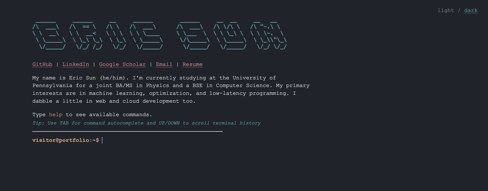
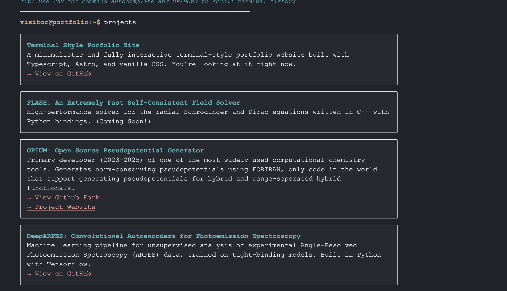

# About

See the live website on [ericsun.net](https://ericsun.net/).

A simple and lightweight terminal-style portfolio written in Astro, CSS, and Typescript. Supports the visitor typing commands to pull information from the profile, light / dark mode, and is configured to be highly customizable.

Main page:



Example response after typing in a command:



# Installation

```sh
npm install
```

# Development

```sh
npm run dev
```

Visit `localhost:4321` to view the site locally.
