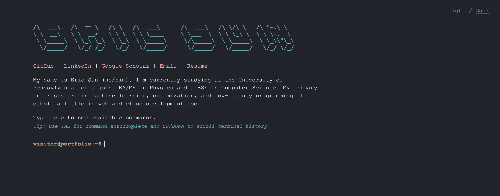
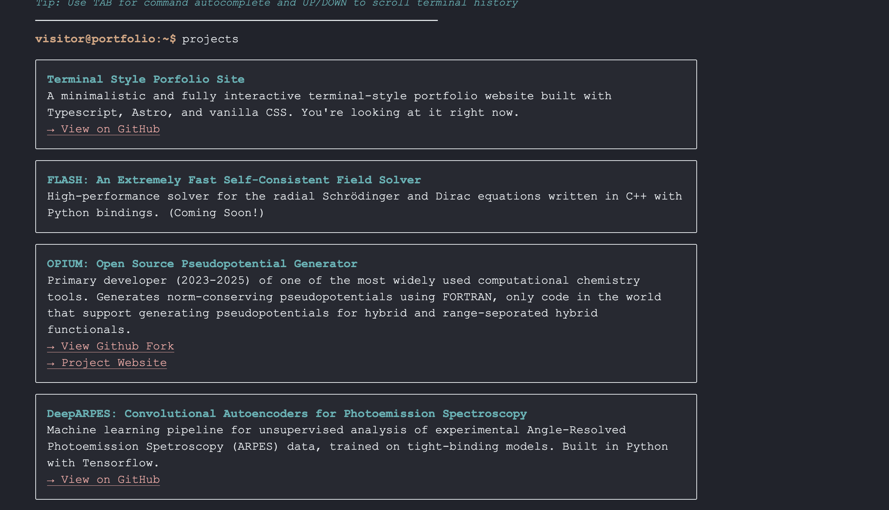

# About

See the live website on [ericsun.net](https://ericsun.net/).

A simple and lightweight terminal-style portfolio written in Astro, CSS, and Typescript. Supports the visitor typing commands to pull information from the profile, light / dark mode, and is configured to be highly customizable.

Main page:



Example response after typing in a command:



# Installation

```sh
npm install
```

# Development

```sh
npm run dev
```

Visit `localhost:4321` to view the site locally.

# Production build

```sh
npm run build
npm run preview
```

The build writes the static site to `dist/`.

Run `npm install` before using the npm scripts. They invoke this project's local
Astro executable explicitly because the unrelated Astronomer CLI also uses the
command name `astro`. For other Astro commands, use `npm run astro -- <command>`.
